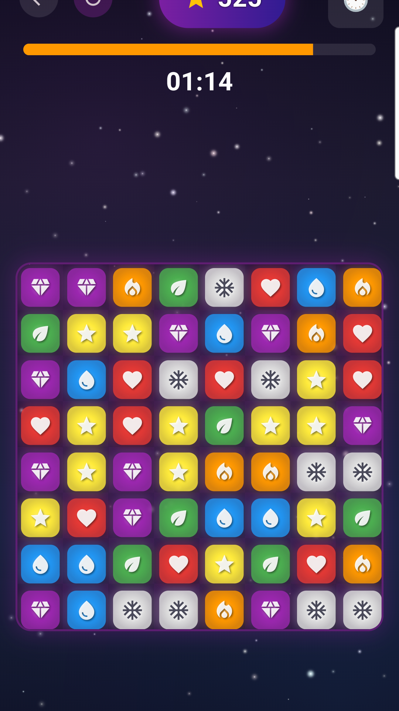

# Gems

A classic match-3 puzzle game built with Flutter.

<p align="center">
  
</p>

## Features

- **4 Game Modes**
  - *Timed* - Score as many points as possible in 90 seconds
  - *Moves* - Maximize your score in 30 moves
  - *Target* - Reach the goal score to advance through levels
  - *Zen* - Relax and play at your own pace

- **Pinch to Resize** - Adjust the board from 5x5 to 10x10
- **Local Leaderboards** - Compete with friends on the same device
- **Combo System** - Chain reactions for bonus points
- **No Ads, No Tracking** - Just a game

## Download

[](https://play.google.com/store/apps/details?id=ai.positronic.gem_game)

## Building from Source

```bash
# Clone the repo
git clone https://github.com/Positronic-AI/gems.git
cd gems

# Install dependencies
flutter pub get

# Run in debug mode
flutter run

# Build release APK
flutter build apk --release

# Build release bundle (for Play Store)
flutter build appbundle --release
```

## Privacy

Gems collects no data. Everything stays on your device. See our [Privacy Policy](https://lit.ai/privacy).

## License

MIT License - see [LICENSE](LICENSE) for details.
